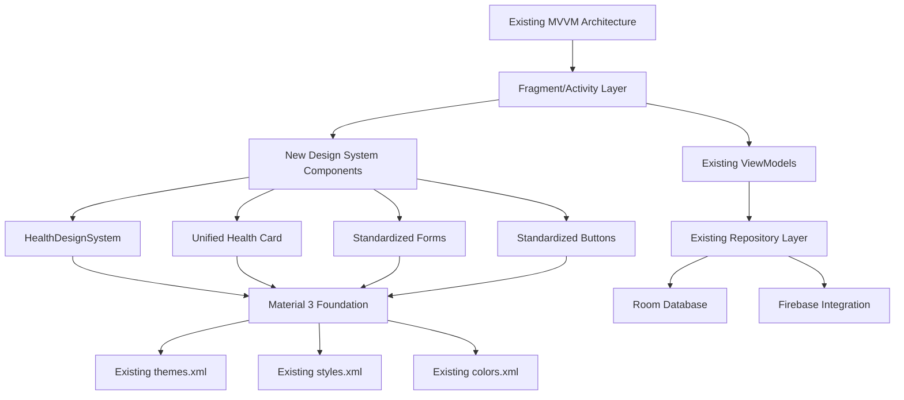

# Coding Standards

## Design System Implementation Standards

### Component Naming Conventions
- **Health prefix**: All design system components use `Health` prefix (e.g., `HealthCardComponent`, `HealthButton`)
- **Kotlin files**: Use PascalCase for classes, camelCase for functions and variables
- **Resource files**: Use snake_case for XML resources, maintain existing patterns

### File Organization Standards
- **Design system components**: Place under `core/design/` package
- **Feature-specific components**: Place under existing feature modules in `components/` subdirectory
- **Resource organization**: Extend existing `values/` structure, add `design_tokens.xml`

### Code Quality Standards
- **Material 3 foundation**: All components must extend existing Material 3 base components
- **Existing architecture preservation**: No changes to MVVM patterns, ViewModels, or navigation
- **Performance compliance**: UI changes must not increase memory usage >15% or affect startup time >200ms
- **Accessibility**: All components must achieve WCAG 2.1 AA compliance

### Integration Standards
- **Backward compatibility**: Must maintain existing user data and preferences without migration
- **API preservation**: No changes to existing Guardian API or health data API integrations
- **Database integrity**: Room + Firebase structure must remain unchanged
- **Theme support**: Must support both light/dark themes with health-focused green branding

### Testing Standards
- **Unit tests**: Required for all new design system components
- **UI tests**: Required for component integration and theme switching
- **Accessibility tests**: Required for WCAG compliance validation
- **Performance tests**: Required to validate NFR1 compliance

## Component Architecture

### Unified Health Card Component
**Responsibility:** Standardized card layout for all health-related content across the application  
**Integration Points:** Replaces existing card_background_elevated, card_background_alt, glassmorphism_card_background usage  

**Key Interfaces:**
- `HealthCardView(content: @Composable () -> Unit, cardType: HealthCardType)`
- `HealthCardStyle.Primary/Secondary/Elevated` style variants

**Dependencies:**
- **Existing Components:** Extends Material 3 CardView foundation
- **New Components:** Uses StandardizedSpacing and HealthColorSystem

**Technology Stack:** Kotlin with existing Material 3 CardView as base

### Standardized Design System Components
**Responsibility:** Centralized design tokens and component styles for consistent UI implementation  
**Integration Points:** Integrates with existing themes.xml and styles.xml without replacement  

**Key Interfaces:**
- `HealthDesignSystem.Colors` - Standardized color palette
- `HealthDesignSystem.Typography` - Unified text styles
- `HealthDesignSystem.Spacing` - Consistent spacing system
- `HealthDesignSystem.Components` - Reusable component styles

**Dependencies:**
- **Existing Components:** Extends current Material 3 theme system
- **New Components:** Foundation for all other standardized components

**Technology Stack:** XML resources extending existing theme structure

### Consistent Form Input System
**Responsibility:** Standardized TextInputLayout styling and validation patterns across all forms  
**Integration Points:** Replaces inconsistent form styling in auth, profile, and journal screens  

**Key Interfaces:**
- `HealthTextInputLayout` - Standardized input field component
- `HealthFormValidation` - Consistent validation styling

**Dependencies:**
- **Existing Components:** Uses existing TextInputLayout and validation logic
- **New Components:** Integrates with HealthDesignSystem for consistent styling

**Technology Stack:** Extends existing Material 3 TextInputLayout components

### Standardized Button System
**Responsibility:** Unified primary, secondary, and tertiary button styles with consistent interaction states  
**Integration Points:** Replaces various button styles across home, profile, and feature screens  

**Key Interfaces:**
- `HealthButton.Primary/Secondary/Tertiary` - Button style variants
- `HealthButtonState` - Consistent interaction states

**Dependencies:**
- **Existing Components:** Extends existing Material 3 Button foundation
- **New Components:** Uses HealthDesignSystem color and spacing tokens

**Technology Stack:** XML styles extending existing button components

## Component Interaction Diagram

